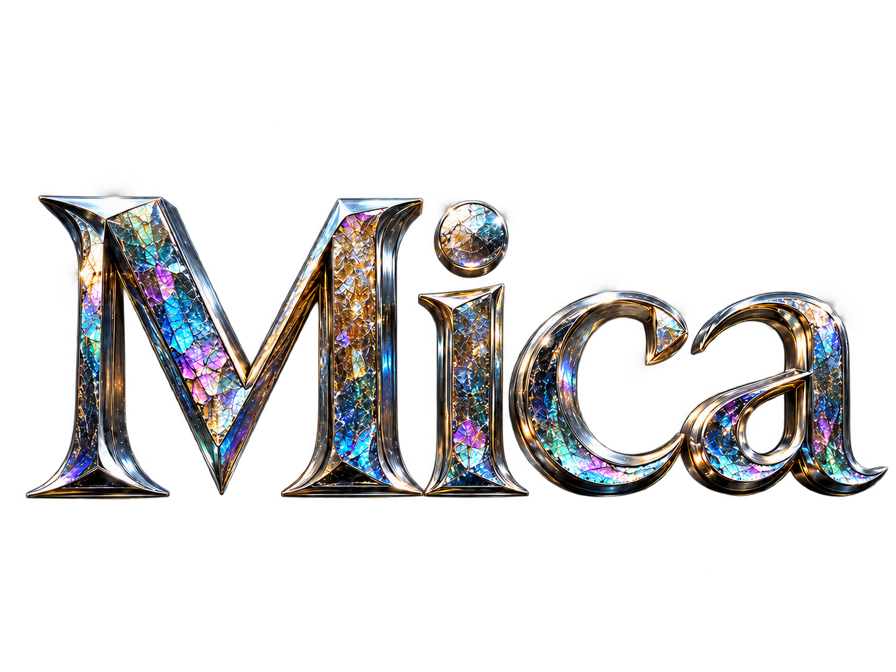

<p align="center">
  
</p>

# Mica
Terminal emulator focused on smooth motion and lightweight rendering.


### Mission

- Lightweight terminal emulator
- Smooth and fluid motions, and or animations
- Extensible via open source code
- Diverging from biased appendages

> [!NOTE]
> **Projected release**: 2026 August

### Features
> `alpha 0.1`

1. Smooth kareting
2. Smooth cursor blink
3. Config is a file — one file, and nothing else writes it

### Keyboard

Settings: `cmd+,` — opens `settings.toml` in your editor

Reload Settings: `cmd+shift+,` — applies the file without leaving Mica

Every binding is listed in `settings.toml` under `[keys]`, with a commented
catalogue of every action above it. A binding named `text:…` types the rest of
its name into the shell:

```toml
[keys]
"text:clear && ls -la\n" = "cmd+shift+l"
```

### Terminal interaction

- Drag to select; double-click selects a word; triple-click selects a line;
  Option-drag makes a rectangular selection.
- `cmd+a` selects the focused pane's complete scrollback; `cmd+c` copies and
  `cmd+v` pastes using the child process's negotiated bracketed-paste mode.
- Set `copy-on-select = true` under `[selection]` to copy when a drag ends.
- Mouse-aware CLI applications receive pointer, wheel and focus events. Hold
  Shift while dragging to select terminal text instead.
- macOS input methods, OSC 8 Command-click links, OSC 52 clipboard writes,
  bell policy and terminal notifications are supported.

### Shell integration

Zsh chains `.zprofile`, `.zshenv`, and `.zshrc` from the user's original
`ZDOTDIR`, so aliases can find executables added to `PATH` by login-profile
setup.

### Build and run locally

Notarisation is not required to compile or run a local build. Mica needs macOS
14 or newer, Rust 1.90, Xcode or the Command Line Tools for `xcrun metal` and
`xcrun metallib`, and a working Metal device. Zig is not required for the
default Alacritty backend.

```sh
export PATH="$HOME/.cargo/bin:/opt/homebrew/bin:$PATH"
cargo build --release -p mica-shell --bin mica
./bundle.sh release
open target/release/Mica.app
```

The bundle is ad-hoc signed for local use. A copy downloaded from elsewhere
may still trigger a Gatekeeper warning; Developer ID signing and notarisation
are distribution requirements, not build requirements. The full workspace
test suite includes Metal renderer tests and must run on a machine with a
working Metal device; otherwise those tests report `NoDevice` even though the
project can compile.
